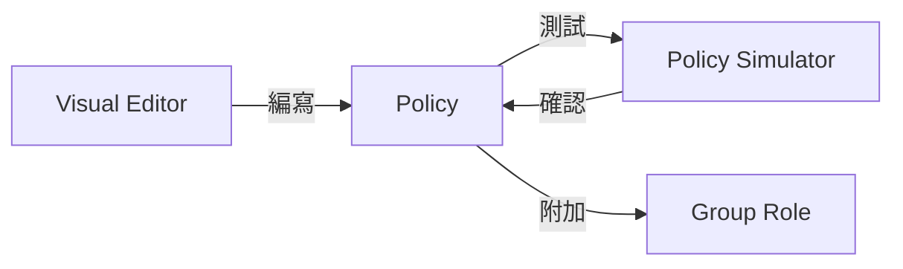
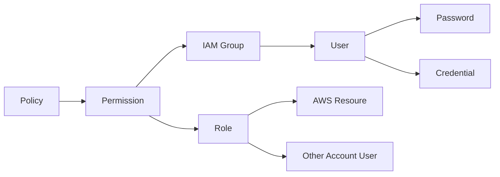

[TOC]


# IAM

AWS 的 Root 帳號類似於 Linux ，權限非常大。因此在前面建立 AWS 帳號的時候，我特別先另外建一個 IAM User。

 **I**dentity and **A**ccess **M**anagement，是 AWS 做身分驗證和授權的基礎設施。

提供以下:

- 建立使用者 (實際的使用者或是供應用程式使用)


> 會放在 S3 後面是我們需要有一個 AWS 的服務可以做範例的。


## 最小權限原則

Least Privilege ，AWS 推行的一個看法。

基本上就是使用者只會用到 EC2，就不要給他 S3 等不相干的權限。

如果公司許多角色都會使用 AWS ，且定義明確，可以使用這個原則。


# 運作方式

這邊可以參考 AWS 官方的架構圖


# 許可 (Policy)

Policy 設定為 JSON 格式，主要有五種屬性可以設定。

- E: Effect, 影響
- P: Principal, 主體
- C: Condition, 條件
- A: Action, 動作
- R: Resource, 資源

> 可以用 EPACR 來記憶，而最常見的案例是 EAR


AWS 有提供一些已經寫好的 Policy，我們舉兩種角色在實務情境下他們各自設定的 Policy JSON 定義: `AdministratorAccess`, `DatabaseAdministrator`

*AdministratorAccess*

```
{
    "Version": "2012-10-17",
    "Statement": [
        {
            "Effect": "Allow",
            "Action": "*",
            "Resource": "*"
        }
    ]
}
```

*DatabaseAdministrator*

```
{
    "Version": "2012-10-17",
    "Statement": [
        {
            "Effect": "Allow",
            "Action": [
                "cloudwatch:DeleteAlarms",
                "cloudwatch:Describe*",
                "cloudwatch:DisableAlarmActions",
                "cloudwatch:EnableAlarmActions",
                "cloudwatch:Get*",
                "cloudwatch:List*",
                "cloudwatch:PutMetricAlarm",
                "datapipeline:ActivatePipeline",
                "datapipeline:CreatePipeline",
                "datapipeline:DeletePipeline",
                "datapipeline:DescribeObjects",
                "datapipeline:DescribePipelines",
                "datapipeline:GetPipelineDefinition",
                "datapipeline:ListPipelines",
                "datapipeline:PutPipelineDefinition",
                "datapipeline:QueryObjects",
                "dynamodb:*",
                "ec2:DescribeAccountAttributes",
                "ec2:DescribeAddresses",
                "ec2:DescribeAvailabilityZones",
                "ec2:DescribeInternetGateways",
                "ec2:DescribeSecurityGroups",
                "ec2:DescribeSubnets",
                "ec2:DescribeVpcs",
                "elasticache:*",
                "iam:ListRoles",
                "iam:GetRole",
                "kms:ListKeys",
                "lambda:CreateEventSourceMapping",
                "lambda:CreateFunction",
                "lambda:DeleteEventSourceMapping",
                "lambda:DeleteFunction",
                "lambda:GetFunctionConfiguration",
                "lambda:ListEventSourceMappings",
                "lambda:ListFunctions",
                "logs:DescribeLogGroups",
                "logs:DescribeLogStreams",
                "logs:FilterLogEvents",
                "logs:GetLogEvents",
                "logs:Create*",
                "logs:PutLogEvents",
                "logs:PutMetricFilter",
                "rds:*",
                "redshift:*",
                "s3:CreateBucket",
                "sns:CreateTopic",
                "sns:DeleteTopic",
                "sns:Get*",
                "sns:List*",
                "sns:SetTopicAttributes",
                "sns:Subscribe",
                "sns:Unsubscribe"
            ],
            "Resource": "*"
        },
        {
            "Effect": "Allow",
            "Action": [
                "s3:AbortMultipartUpload",
                "s3:DeleteObject*",
                "s3:Get*",
                "s3:List*",
                "s3:PutAccelerateConfiguration",
                "s3:PutBucketTagging",
                "s3:PutBucketVersioning",
                "s3:PutBucketWebsite",
                "s3:PutLifecycleConfiguration",
                "s3:PutReplicationConfiguration",
                "s3:PutObject*",
                "s3:Replicate*",
                "s3:RestoreObject"
            ],
            "Resource": [
                "*"
            ]
        },
        {
            "Effect": "Allow",
            "Action": [
                "iam:PassRole"
            ],
            "Resource": [
                "arn:aws:iam::*:role/rds-monitoring-role",
                "arn:aws:iam::*:role/rdbms-lambda-access",
                "arn:aws:iam::*:role/lambda_exec_role",
                "arn:aws:iam::*:role/lambda-dynamodb-*",
                "arn:aws:iam::*:role/lambda-vpc-execution-role",
                "arn:aws:iam::*:role/DataPipelineDefaultRole",
                "arn:aws:iam::*:role/DataPipelineDefaultResourceRole"
            ]
        }
    ]
}
```


也有以下不同類型:

- 受 AWS 控管
  - 其中常見職業角色賦予的權限，職務職能 ( Job Function)


## 編寫 Policy 的步驟





在 AWS Web Console 建立 Policy 的時候，就可以透過 Visual Editor 來建立。

不確定 Policy 建立之後的結果，可以使用 [Policy Simulator](https://policysim.aws.amazon.com/) 來測試。

最終確認完的結果，附加到 Group Role。


# 角色 (Role)

AWS 服務之間要互相溝通，中間需要透過 Role


User Groups vs Role?


# 驗證機制


# 架構設計




# What's Permissions?

在設定 IAM 帳號的時候有出現，


這邊有一些受 AWS 控管的 Policy 已經建立好可以使用。


ACL 也算在 IAM 的管理裡面


# 結論

IAM 是 AWS 在資安管控上最基本的必修課。清楚了解它的功能對於日後在設計網站的時候也能提供不少權限控制的想法。

而且 AWS 也提供很大的彈性


# 參考資料

[了解 IAM 的運作方式](https://docs.aws.amazon.com/zh_tw/IAM/latest/UserGuide/intro-structure.html)

[AWS 角色功能](https://docs.aws.amazon.com/zh_tw/IAM/latest/UserGuide/access_policies_job-functions.html)

https://docs.aws.amazon.com/IAM/latest/UserGuide/intro-structure.html


