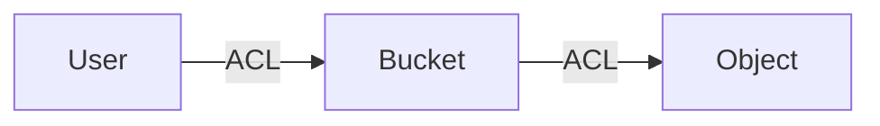
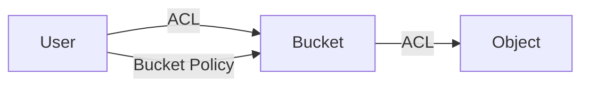
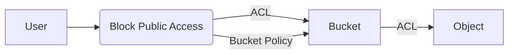

[TOC]

# S3 

S3，是 AWS 提供的檔案儲存服務，其全名為 Simple Storage Service。

其應用不是只有單純的提供你讓你的應用程式或是網頁存檔案的需求。

可以把您的靜態網站放在 S3 。

也可以將 AWS 現有雲端原生應用程式與 S3 做整合。建立更有彈性且可靠的服務。

執行大數據分析、AI、ML、HPC 所需要的資料湖泊也會需要 S3 的協助。

備份、災難 (DR) 復原也需要他的存在。

同時也可以將儲存類別設為 S3 Glacier ，幫助你封存可能長期不會使用的檔案。

# Bucket & Object

裡面提到了兩個元件，如果以魚跟冰桶來比喻。

魚就是 Obejct；冰桶就是 Bucket

換句話說，你要儲存的檔案是 Object，檔案儲存的空間是 Bucket

Object 依附在 Bucket 底下，且 Object 有一個 唯一 的 https 連結。

> 可以透過唯一 的 https 連結下載 Object，但是預設會被擋下來。需搭配權限控管才可以下載
>

# S3 儲存類型

在儲存方案的選擇，我們需要考量兩種因素: 可用性 (Availability) 及耐久性 (Durability)。

我這邊一樣使用魚跟冰桶來比喻。

*可用性* 是，你將魚放到冰桶，你還能不能拿回來。

*耐久性* 是，你將魚從冰桶拿回來，這條魚是不是已經臭掉了。

因此可用性在於檔案能不能取回；耐久性在於檔案取回時能不能使用。

有分以下幾種儲存類型:	

- **S3 Standard**
  - 檔案經常存取的情境
  - 儲存任務關鍵型生產資料
- **S3 Intelligent-Tiering**
  - 智慧分層
  - 針對具有不斷變化、未知或不可預測存取模式的資料
  - 適合資料湖泊、分析或新的應用程式
  - 針對經常、不常和很少存取這三個存取方案之間移動資料，進行最佳化且提供低延遲的服務
  - 物件的子集一段時間被封存後，可以啟用專為非同步存取而設計的封存存取方案 Glacier
- **S3 IA**
  - S3 -Infrequent Access 
  - 儲存不常存取的資料，會另外計算擷取費用
  - 不會有資料解凍時間
  - 有分 Standard 跟 One Zone 兩種，差異在於可用區域的數量
    - Standard 可用區域 >= 3
    - One Zone 可用區域 = 1
- **S3 Glacier**
  - Glacier 是冰河的意思
  - 會有資料解凍時間
  - 細節可參考以下篇章
- **S3 Outposts**
  - 這是針對 On-Premises 的資料去儲存 

## S3 Glacier

為封存而生的儲存類別。

***最好的效能、最大彈性、最低成本***

*真的只能擇一嗎?*

> 小孩子才做選擇，大人全都要!

我們可以針對不同的使用情況去挑選，可以以使用資料的頻率去判斷資料熱度，這也是蠻多公司會去做的冷熱資料分流，在 AWS S3 Glacier 就幫你做好了。

分為以下三種:

- Amazon S3 Glacier Instant Retrieval
  - 針對需要立即存取的封存資料，這是一種封存儲存類別，可提供低成本的儲存和毫秒級擷取
  - 例如醫學影像、新聞媒體資產或基因體資料
- Amazon S3 Glacier Flexible Retrieval
  - 針對不需要立即存取但需要靈活且免費擷取大型資料集的封存資料
  - 幾分鐘內即可擷取，或在 5-12 小時內免費大量擷取
  - 例如備份或災難復原使用案例
- Amazon S3 Glacier Deep Archive
  - 若要在長效封存存儲節省更多費用，請選擇 S3 Glacier Deep Archive，這是雲端中成本最低的儲存，資料擷取時間為 12 小時內。
  - 例如合規封存和數位媒體保存或是幾年以上的帳單資料封存

基本上這些資料擷取時間可以想像成 ***食物解凍*** 的時間。你可以在接下來多久的時間內取得。

# 複寫

S3 提供兩種複寫方式，將同一份資料複製到不同地方，強化備份，讓可用性可高。

- 跨區域複寫 (CRR): 不同 AWS 區域間的 Bucket 物件複製。如新加坡到東京。

- 相同區域複寫(SRR): 相同 AWS 區域間的 Bucket 物件複製。如新加坡有 3 個可用區域，就可以複製 3 份。

  

# 檔案加密

加密種類有分為兩種加密方法:

- Server-Side 加密
  - 存放在 AWS KMS 中的 KMS 金鑰
  - 受 S3 託管的加密金鑰
    - 不需要
  - 客戶提供的加密金鑰
- Client-Side 加密
  - 使用存放在 AWS KMS 中的 KMS 金鑰
  - 使用存在本地應用程式的加密金鑰

> ※S3 僅支援對稱加密 KMS 金鑰，而不支援非對稱 KMS 金鑰。
> 因為加密的對象是檔案，所以不會使用非對稱式金鑰來加密

>  S3 在 Client-Side 加密，在加密或解密中不會扮演任何角色。

# 權限控管

對外有三種管理機制:

- Access Control List (ACL)

- Bucket Policy

- Block Public Access

  

對內有一種防線:

- IAM Policy

​	

## IAM Policy

對內的意思為在 AWS 的使用者。能透過 IAM 的 Policy 限制該 User 的權限。

## ACL

存取控制清單 (Access Control List), Bucket 和 Object 都有各自的 ACL，但是對外以 Bucket 設定的 ACL 為主。

S3 提供幾種預先定義的群組:

- 已驗證的使用者
  - 通過 AWS 身分驗證的 AWS 帳號
- 所有使用者
  - 允許世界上任何人存取資源。包含通過身分驗證跟匿名使用者。

可以授予 (Grant) 以下許可 (Permission):

- READ
- WRITE
- READ_ACP
- WRITE_ACP
- FULL_CONTROL

後面有加 _ACP 的是讀且或寫入 ACL

所以最常見是設定授予 (Grant) 所有使用者 擁有 READ 這個許可(Permission)。

## Bucket Policy

可以設定更細緻的限制。例如特定 IP，特定的 Http Header 封包。

## Block Public Access

限制檔案不可直接公開。避免設定調整疏失導致 Bucket 跟 Object 直接對外

# 備份及還原

災難復原 (DR) 講求的 RTO 和 RPO

## 檔案刪除

怎麼避免檔案誤刪，或是異動成錯誤資料，有分為以下幾種:

- Version
  - 透過版本控制，檔案可以更新，也可以還原成舊版。
- MFA Delete
  - 需要透過手機等多因子驗證，才可將檔案刪除。
- Object Lock
  - 透過物件鎖可以把刪除功能鎖住。

# 參考資料

[Day 03 - 任你存S3 - iT 邦幫忙::一起幫忙解決難題，拯救 IT 人的一天 (ithome.com.tw)](https://ithelp.ithome.com.tw/articles/10260548)

