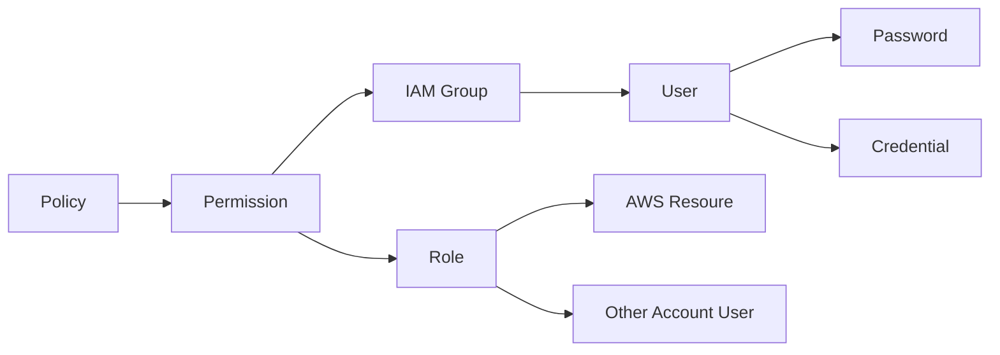
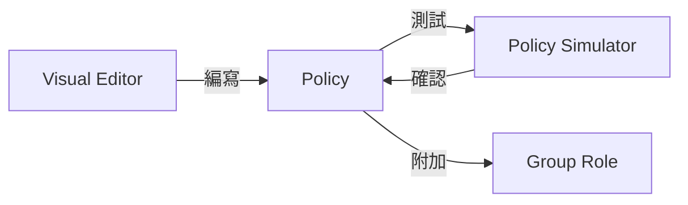

[TOC]

# IAM

AWS 的 Root 帳號類似於 Linux ，權限非常大。因此在前面建立 AWS 帳號的時候，我特別先另外建一個 IAM User。

> 會放在 S3 後面是我們需要有一個 AWS 的服務可以做範例的。


 **I**dentity and **A**ccess **M**anagement，是 AWS 做身分驗證和授權的基礎設施。(前面 S3 用到的 ACL，也算在 IAM 的管理裡面)

其擁有以下特點及功能:

- 建立使用者 (實際的使用者或是供應用程式使用)
  - 也可設定 MFA 和設定使用者密碼規則

- 共用 AWS 資源，並用安全的方式進行存取
  - 也可授予侷限的功能給特定的使用者

- 暫時授予其他擁有密碼的使用者(如公司網路)操作 AWS 的權限
- IAM 身分會留下稽核紀錄 (CloudTrail)
- 最終一致性
  - IAM 為跨資料中心內多部伺服器來達成高可用性

- 可搭配標籤功能達成 ABAC(Attribute Based Access Control) 的權限控管


## 最小權限原則

Least Privilege ，AWS 推行的一個看法。

基本上就是使用者只會用到 EC2，就不要給他 S3 等不相干的權限。

如果公司許多角色都會使用 AWS ，且定義明確，可以使用這個原則。


# 運作方式

這邊可以參考 AWS 官方的架構圖


這邊官方說了很多種術語:
- IAM 資源
  - 使用者、使用者群組、角色、政策等 IAM 定義

- IAM 身分
  - 用於識別、群組的 IAM 資源
  - 這些 IAM 可以被附加政策 (Policy) ，包含使用者、使用者群組、角色。

- IAM 實體
  - 用於驗證的 IAM 資源。其中包含 IAM 使用者跟 IAM 角色

- 委託人

委託人 (Principal) 是指誰向 AWS 索取服務，剩下的可以參考


## 結構設計




# 政策 (Policy)

Policy 設定為 JSON 格式，主要有五種屬性可以設定。

- E: Effect, 影響
- P: Principal, 主體
- C: Condition, 條件
- A: Action, 動作
- R: Resource, 資源

> 可以用 EPACR 來記憶，而最常見的案例是 EAR


AWS 有提供一些已經寫好的 Policy，我們舉兩種角色在實務情境下他們各自設定的 Policy JSON 定義: `AdministratorAccess`, `DatabaseAdministrator`

*AdministratorAccess*

```
{
    "Version": "2012-10-17",
    "Statement": [
        {
            "Effect": "Allow",
            "Action": "*",
            "Resource": "*"
        }
    ]
}
```

*DatabaseAdministrator*

```
{
    "Version": "2012-10-17",
    "Statement": [
        {
            "Effect": "Allow",
            "Action": [
                "cloudwatch:DeleteAlarms",
                "cloudwatch:Describe*",
                "cloudwatch:DisableAlarmActions",
                "cloudwatch:EnableAlarmActions",
                "cloudwatch:Get*",
                "cloudwatch:List*",
                "cloudwatch:PutMetricAlarm",
                "datapipeline:ActivatePipeline",
                "datapipeline:CreatePipeline",
                "datapipeline:DeletePipeline",
                "datapipeline:DescribeObjects",
                "datapipeline:DescribePipelines",
                "datapipeline:GetPipelineDefinition",
                "datapipeline:ListPipelines",
                "datapipeline:PutPipelineDefinition",
                "datapipeline:QueryObjects",
                "dynamodb:*",
                "ec2:DescribeAccountAttributes",
                "ec2:DescribeAddresses",
                "ec2:DescribeAvailabilityZones",
                "ec2:DescribeInternetGateways",
                "ec2:DescribeSecurityGroups",
                "ec2:DescribeSubnets",
                "ec2:DescribeVpcs",
                "elasticache:*",
                "iam:ListRoles",
                "iam:GetRole",
                "kms:ListKeys",
                "lambda:CreateEventSourceMapping",
                "lambda:CreateFunction",
                "lambda:DeleteEventSourceMapping",
                "lambda:DeleteFunction",
                "lambda:GetFunctionConfiguration",
                "lambda:ListEventSourceMappings",
                "lambda:ListFunctions",
                "logs:DescribeLogGroups",
                "logs:DescribeLogStreams",
                "logs:FilterLogEvents",
                "logs:GetLogEvents",
                "logs:Create*",
                "logs:PutLogEvents",
                "logs:PutMetricFilter",
                "rds:*",
                "redshift:*",
                "s3:CreateBucket",
                "sns:CreateTopic",
                "sns:DeleteTopic",
                "sns:Get*",
                "sns:List*",
                "sns:SetTopicAttributes",
                "sns:Subscribe",
                "sns:Unsubscribe"
            ],
            "Resource": "*"
        },
        {
            "Effect": "Allow",
            "Action": [
                "s3:AbortMultipartUpload",
                "s3:DeleteObject*",
                "s3:Get*",
                "s3:List*",
                "s3:PutAccelerateConfiguration",
                "s3:PutBucketTagging",
                "s3:PutBucketVersioning",
                "s3:PutBucketWebsite",
                "s3:PutLifecycleConfiguration",
                "s3:PutReplicationConfiguration",
                "s3:PutObject*",
                "s3:Replicate*",
                "s3:RestoreObject"
            ],
            "Resource": [
                "*"
            ]
        },
        {
            "Effect": "Allow",
            "Action": [
                "iam:PassRole"
            ],
            "Resource": [
                "arn:aws:iam::*:role/rds-monitoring-role",
                "arn:aws:iam::*:role/rdbms-lambda-access",
                "arn:aws:iam::*:role/lambda_exec_role",
                "arn:aws:iam::*:role/lambda-dynamodb-*",
                "arn:aws:iam::*:role/lambda-vpc-execution-role",
                "arn:aws:iam::*:role/DataPipelineDefaultRole",
                "arn:aws:iam::*:role/DataPipelineDefaultResourceRole"
            ]
        }
    ]
}
```


基本上 Action 裡面紀錄的的是 AWS 的 Permisson 。 

Resource 紀錄的是 ARN，也就是受影響的資源。


也有以下不同類型:

- 受 AWS 控管的 Policy
  - 常見的職業角色都有它對應的職務職能 ( Job Function)，依據這些職能去賦予對應的權限
- 受客戶控管的 Policy
  - 客戶，也就是指我們這些使用 AWS 的人，自己去設計權限。


## 編寫 Policy 的步驟





在 AWS Web Console 建立 Policy 的時候，就可以透過 Visual Editor 來建立。

不確定 Policy 建立之後的結果，可以使用 [Policy Simulator](https://policysim.aws.amazon.com/) 來測試。

最終確認完的結果，附加到 Group Role。


# 角色 (Role)

角色能被賦予到 AWS 的服務上面。AWS 服務之間要互相溝通，中間需要透過 Role。

例如我建立了一個 EC2 ，我可以針對我建立的 EC2 指定它的 Role，設定它擁有 S3 的讀取權限。


# 結論

IAM 是 AWS 在資安管控上最基本的必修課。清楚了解它的功能對於日後在設計軟體時也能提供不少權限控制的想法。

而且 AWS 也提供很大的彈性去調整，可以針對實際遇到的狀況去進行調整。

了解 IAM 能做什麼，Policy 可以怎麼寫，對於日後需要客製化存取 AWS 服務能更快速、準確的寫對。

如果使用情境單純，不妨使用 AWS 現有的角色去去達成您的需求。


# 參考資料

[了解 IAM 的運作方式](https://docs.aws.amazon.com/zh_tw/IAM/latest/UserGuide/intro-structure.html)

[AWS 角色功能](https://docs.aws.amazon.com/zh_tw/IAM/latest/UserGuide/access_policies_job-functions.html)

[了解 IAM 的運作方式](https://docs.aws.amazon.com/IAM/latest/UserGuide/intro-structure.html)

[AWS 的 ABAC 是什麼？ - AWS Identity and Access Management (amazon.com)](https://docs.aws.amazon.com/zh_tw/IAM/latest/UserGuide/introduction_attribute-based-access-control.html)
